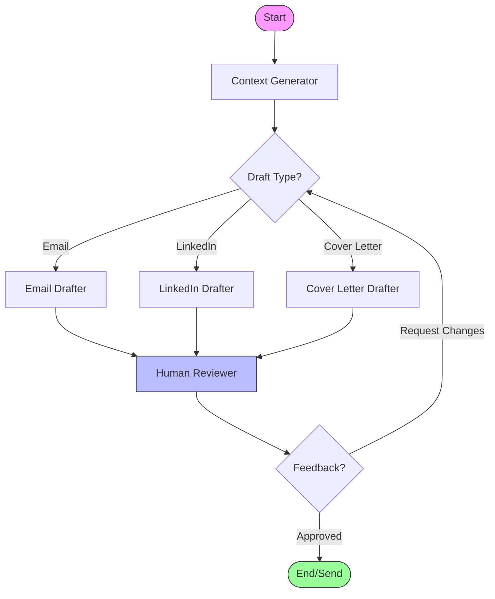

# ✉️ Agent Mailer - Intelligent Deep Agent System

**Agent Mailer** is a sophisticated **Human-in-the-Loop (HITL)** AI application designed to automate professional outreach. Built on the **Deep Agent** architecture, it leverages **LangChain**, **LangGraph**, and **LangSmith** to generate, refine, and dispatch hyper-personalized Emails, LinkedIn Messages, and Cover Letters.

## 🧠 Deep Agent Architecture

This system is not just a simple LLM wrapper; it is a **Multi-Agent System** guided by a cyclic state machine.

### Core Components
1.  **Deep Agents**: Specialized autonomous units responsible for specific tasks.
    -   `content_generator`: Performs deep analysis of the Job Description (JD) to build a "Context" layer.
    -   `drafters` (Email/LinkedIn/Cover Letter): Specialized agents that consume the Context and generate channel-specific drafts.
2.  **LangGraph State Machine**: Orchestrates the flow of information. It defines the "Brain" of the application, managing state transitions between generation, review, and feedback loops.
3.  **LangSmith Integration**:
    -   **Prompt Management**: All system prompts (e.g., `email_drafter_prompt`) are version-controlled and pulled dynamically from LangSmith (`context_generator:f92e9e5f`), ensuring easy updates without code changes.
    -   **Observability**: Traces every step of the agent's reasoning process.

## 🔄 Agentic Workflow

The application follows a generic cyclic graph structure. It uses **Conditionals** to route tasks and **Interrupts** for Human-in-the-Loop interaction.



### Key Logic
1.  **Context Caching**: The system intelligently caches the `context` generated from the JD. Switching output types (e.g., Email -> LinkedIn) skips the expensive analysis step.
2.  **HITL Loop**: The process pauses at the `Reviewer` node. The user can provide natural language feedback (e.g., "Make it more formal"). The state carries this feedback back to the drafting agent, which "remembers" the previous attempt and acts to correct it.

## 🚀 Key Features

-   **Multi-Modal Output**: Supports Emails, LinkedIn Messages, and Cover Letters.
-   **Conversation-Driven UI**: Chat with your agent to refine drafts naturally.
-   **Smart Attachments**: Drag-and-drop file support with automatic fallback to your default CV.
-   **Direct Integration**: Sends emails directly via Gmail API tools.

## 🛠️ Setup & Installation

### Prerequisites
-   Python 3.10+
-   [uv](https://github.com/astral-sh/uv) (Fast Python package manager)

### Installation

1.  **Clone the repository**:
    ```bash
    git clone <repository-url>
    cd draft_mail
    ```

2.  **Install dependencies**:
    ```bash
    uv sync
    ```

3.  **Environment Setup**:
    Create a `.env` file in the root directory:
    ```env
    OPENAI_API_KEY=sk-...
    LANGCHAIN_API_KEY=lsv2-...
    LANGCHAIN_TRACING_V2=true
    LANGCHAIN_PROJECT=Agent-Mailer
    EMAIL_USER=your_email@gmail.com
    EMAIL_PASSWORD=your_app_password
    ```

## 🖥️ Usage

Run the main application using **Streamlit**:

```bash
uv run streamlit run app.py
```

### Workflow
1.  **Input**: Paste the Job Description in the sidebar.
2.  **Select**: Choose your output type (Email, LinkedIn, Cover Letter).
3.  **Collaborate**:
    -   **Review**: See the draft in the right-hand canvas.
    -   **Refine**: Tell the agent "Mention my Python experience" in the feedback box.
    -   **Edit**: Manually tweak the text if needed.
4.  **Action**: Click **Send Email** (for emails) or **Approve** (for others) to finish.

## 📂 Project Structure

```
draft_mail/
├── graph/                  # Core Agent Logic
│   ├── graph.py            # LangGraph State Machine Definition
│   ├── nodes.py            # Agent Functions & Tool Calls
│   ├── chains.py           # LLM & Deep Agent Configuration
│   ├── state.py            # GraphState TypedDict
│   └── schemas.py          # Pydantic Output Schemas
├── utils/                  # Helper Tools
│   ├── email_sender_tool.py
│   └── web_search_tool.py
├── app.py                  # Main Streamlit Application (Entry Point)
├── demo/                   # Assets & Visualizations
│   └── graph.png           # Static workflow visualization
└── pyproject.toml          # Dependency Definition
```
